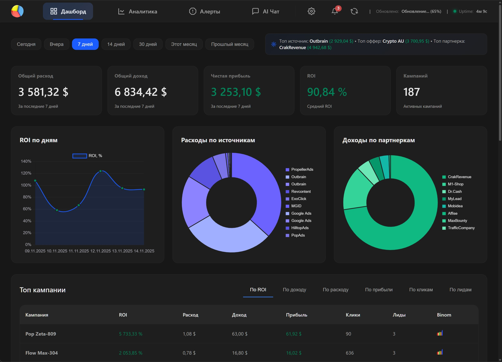
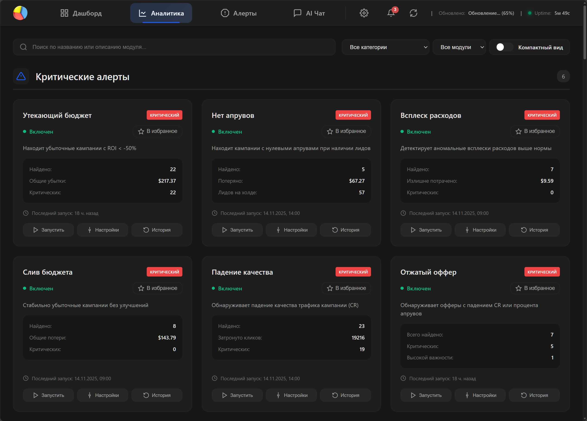
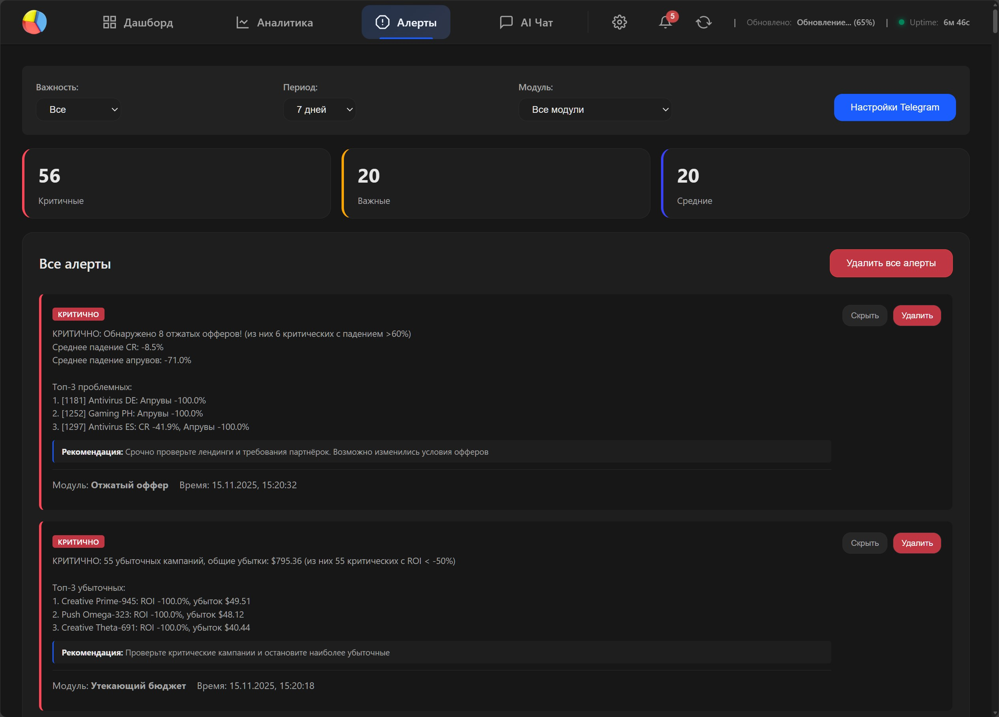
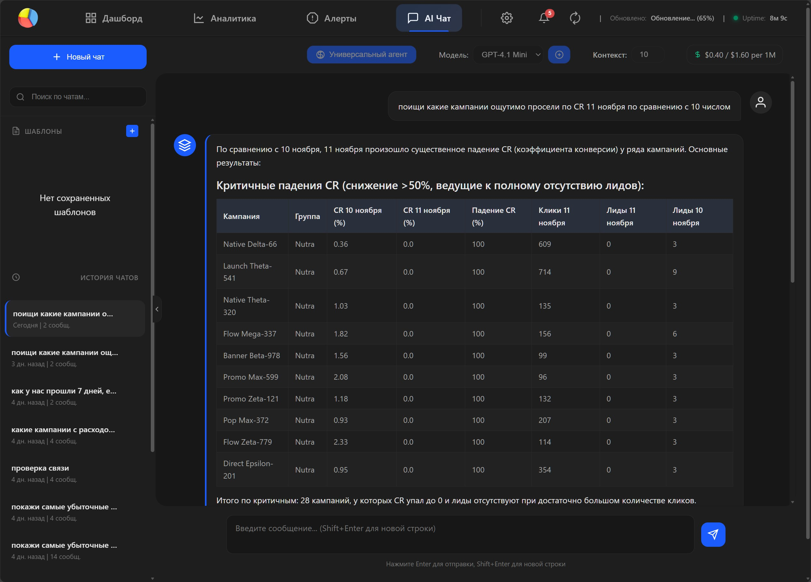
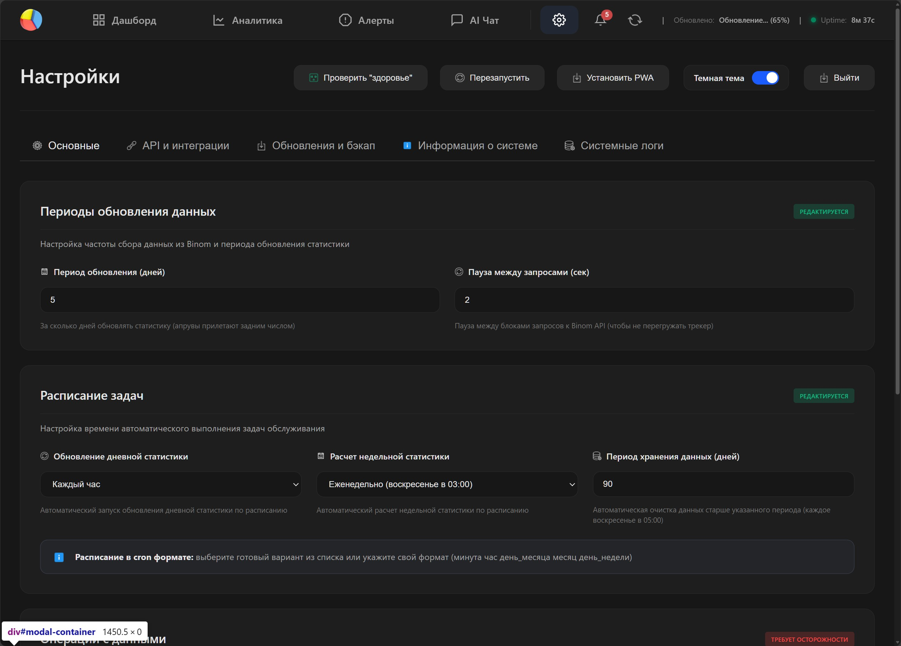

# Binom Assistant


**Интеллектуальная система анализа рекламных кампаний в Binom с AI-модулями**

### 🎥 Демонстрация

https://github.com/garik128/binom_assistant/raw/main/demo/video.mp4

<details>
<summary>📸 <b>Скриншоты интерфейса</b> (нажмите чтобы развернуть)</summary>

<table>
  <tr>
    <td width="50%">
      
      <p align="center"><b>Главная панель</b></p>
    </td>
    <td width="50%">
      
      <p align="center"><b>Модули аналитики</b></p>
    </td>
  </tr>
  <tr>
    <td>
      
      <p align="center"><b>Алерты и уведомления</b></p>
    </td>
    <td>
      
      <p align="center"><b>AI-агент</b></p>
    </td>
  </tr>
  <tr>
    <td colspan="2">
      
      <p align="center"><b>Настройки системы</b></p>
    </td>
  </tr>
</table>

</details>

---


## 💡 О проекте

Создан с помощью **Claude Code** пользователем без какого-либо опыта в программировании.  
Внутри — **лишние файлы, костыли, дыры, дублирующийся код и кривая логика**.  
Всё как положено в Vibe Code  

Разрабатывался **для личных целей** — анализа сотен кампаний и десятков партнёрских сетей  
(в основном нутра и нативка).

---

## ⚠️ Условия использования

Используйте **"AS IS"** — как есть.  
Можете **форкнуть и адаптировать под себя**.  

Никаких претензий, пожеланий и просьб «а можно добавить...» — **не принимается**.  
Всё работает ровно настолько, насколько работает 

---


## ⚡ Основные возможности

### Автоматический сбор данных
- Синхронизация с Binom API (кампании, источники, офферы, партнерки)
- Запуск аналитики по расписанию, уведомления в telegram

### 42 настраиваемых модуля аналитики
Модули разделены на 9 категорий:

- **Critical Alerts (6)**: Детекторы утечки бюджета, нулевых апрувов, скачков расхода
- **Trend Analysis (5)**: Сканеры микротрендов, разворотов, восстановлений
- **Stability (4)**: Оценка стабильности, волатильности, надежности
- **Predictive (5)**: Прогнозы ROI, апрувов, жизненного цикла кампаний
- **Problem Detection (6)**: Спящие кампании, проблемы с маржой, зомби-кампании
- **Opportunities (4)**: Скрытые точки роста, кандидаты на масштабирование
- **Segmentation (3)**: Умная группировка и консолидация кампаний
- **Portfolio (5)**: Оценка здоровья портфеля, диверсификации, оптимизация бюджета
- **Sources & Offers (4)**: Рейтинги офферов, качество источников, мониторинг сетей

### AI-агент для анализа
- Работает через OpenRouter API 
- Умный выбор нужных модулей на основе запроса пользователя
- Генерация человекопонятных отчетов из JSON-данных модулей
- Поддержка комбинирования множества модулей для комплексного анализа

### Автоматизация
- APScheduler для фоновых задач (сбор данных, агрегация, очистка)
- Настраиваемое расписание через Web UI

---

## 🐳 Быстрая установка с Docker

### Требования

**Перед установкой убедитесь что Docker установлен:**

```bash
# Проверить Docker
docker --version

# Проверить Docker Compose
docker compose version
```

**Если Docker не установлен:**

```bash
# Установка Docker (официальный скрипт)
curl -fsSL https://get.docker.com -o get-docker.sh
sudo sh get-docker.sh

# Добавить текущего пользователя в группу docker
sudo usermod -aG docker $USER

# Перелогиниться для применения изменений
newgrp docker

# Проверить что Docker работает
docker run hello-world
```

**Минимальные требования к серверу:**
- Linux (Ubuntu 20.04+, Debian 11+, или совместимые)
- 1 GB RAM (2 GB рекомендуется)
- 5 GB свободного места на диске
- Docker 20.10+
- Docker Compose v2+

---

### Автоматическая установка (1 команда)

**Подготовьте Binom URL и API key (Telegram и OpenRouter - опционально)**

Интерактивный мастер установки на Linux VPS:

```bash
curl -fsSL https://raw.githubusercontent.com/garik128/binom_assistant/main/install.sh -o install.sh && bash install.sh
```

Мастер проведет через 3 фазы:

**Фаза 1: Сбор данных**
- Режим деплоя (IP:port / domain / subdomain / subpath)
- Домен (если нужен)
- Binom URL и API key
- Учетные данные администратора
- Telegram и OpenRouter (опционально)

**Фаза 2: Проверка системы**
- Docker и Docker Compose
- Nginx (установит если нужен)
- Свободный порт 8000
- Существующие конфигурации

**Фаза 3: Установка**
- Автоматическая генерация конфигураций
- Настройка Nginx (если нужен)
- Загрузка Docker образа
- Запуск приложения

**Протестирована только установка "IP:port" на "чистый" VPS с Ubuntu** 

**Другие варианты установки:**
- [Ручная установка с Docker](docs/INSTALLATION.md#ручная-установка-пошагово)
- [Установка без Docker](docs/INSTALLATION.md#установка-без-docker-не-проверено)
- [Production развертывание (systemd, Nginx)](docs/INSTALLATION.md#production-развертывание-не-проверено)
- [Настройка SSL/HTTPS](docs/INSTALLATION.md#настройка-ssl-https)

**Дополнительная документация:**
- [Обновление на новую версию](docs/UPGRADE.md)
- [Решение проблем](docs/TROUBLESHOOTING.md)

---

## 📁 Структура проекта

```
binom_assistant/
├── core/                  # Ядро системы
│   ├── api_client/        # Клиент Binom API (httpx)
│   └── data_processor/    # Обработка и агрегация данных
├── modules/               # 56 модулей аналитики (9 категорий)
├── storage/               # База данных SQLite + миграции
├── interfaces/web/        # FastAPI веб-интерфейс + UI
├── services/              # Сервисы (scheduler, AI agent, settings)
├── config/                # Конфигурация (YAML)
└── tests/                 # Unit и integration тесты

```

Подробнее см. [structure.md](structure.md)

---

## 📚 Документация

- **[RUNNING.md](RUNNING.md)** - Подробная документация по запуску
- **[structure.md](structure.md)** - Структура проекта


### API Документация
После запуска приложения доступна по адресу:
- Swagger UI: http://127.0.0.1:8000/docs
- ReDoc: http://127.0.0.1:8000/redoc

---

## ⚙️ Конфигурация

Основные настройки задаются через:
1. **`.env` файл** - базовая конфигурация (API keys, timezone, БД)
2. **`config.yaml`** - загружает значения из `.env` через подстановку `${VARIABLE_NAME}`
3. **Web UI** - Периоды обновления данных и расписание. Бэкап и восстановление

**Сбор данных:**
- `UPDATE_DAYS_DAILY` - за сколько дней обновлять статистику (по умолчанию: 7)
- Расписание сбора настраивается через Web UI

**AI-агент:**
- Модель, агент, системные промпты - через Web UI

---

## 🧪 Тестирование

```bash
# Запуск всех тестов
python -m pytest tests/

# Unit тесты
python -m pytest tests/unit/

# Integration тесты
python -m pytest tests/integration/

# С покрытием
python -m pytest --cov=binom_assistant tests/
```

---

## 🔧 Технологический стек

**Backend:**
- Python 3.10+
- FastAPI (веб-фреймворк)
- SQLAlchemy (ORM)
- SQLite (база данных)
- httpx (HTTP клиент)
- APScheduler (планировщик задач)

**AI:**
- OpenRouter API

**Frontend:**
- HTML5, CSS3, JavaScript (Vanilla)

**DevOps:**
- Docker & Docker Compose (контейнеризация)
- GitHub Actions (CI/CD)
- Nginx (reverse proxy)
- pytest (тестирование)
- uvicorn (ASGI сервер)

---

## ⚠️ Важные особенности

### Локальная работа и безопасность
Проект полностью работает **локально** — без внешних библиотек, облаков и сторонних сервисов.  
Единственное обязательное внешнее взаимодействие — **Binom API**.

Опционально (если включено в настройках):
- **OpenRouter** — для AI-ответов  
- **Telegram Bot API** — для уведомлений

Вы можете настроить **фаервол** и жёстко ограничить весь исходящий трафик, разрешив только запросы к:
- вашему Binom  
- OpenRouter (если используете)  
- Telegram (если используете)

Остальное приложение не трогает и никуда не «стучится».

---

### Часовой пояс
Система учитывает часовой пояс из `.env` (`TIMEZONE`).  
Все даты в базе хранятся в UTC, локальный TZ применяется только при отображении.

### CPL vs CPA кампании
Автоматическое определение модели оплаты:
- **CPL** (Cost Per Lead): `a_leads = 0`, но `revenue > 0`
- **CPA** (Cost Per Action): `a_leads > 0` или есть `r_leads`

### Read-only режим
Система только **читает** данные из Binom и **никогда ничего не изменяет** через API.

---


## 🤝 Contributing

Проект создан для личного использования, но вы можете форкнуть и адаптировать под себя.

**Если используйте "AS IS"** - учтите, что имеются специфичные настройки (timezone, CPL/CPA логика и т.д.). Обновления и доработки делаются под себя, вам могут помешать.  

